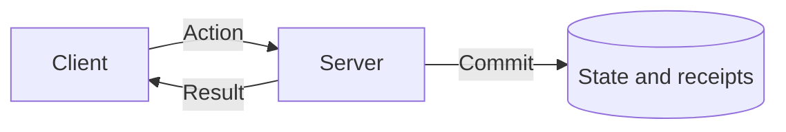

# @yielded/starlight-theme

The shared Starlight theme for yielded.dev docs: design tokens, a TanStack-style library
switcher in the header, Tokyo Night code blocks, and Markdown helpers.

```ts
// docs/astro.config.ts
import starlight from "@astrojs/starlight";
import yieldedTheme from "@yielded/starlight-theme";
import { defineConfig } from "astro/config";

export default defineConfig({
  site: "https://yielded.dev",
  base: "/sync",
  integrations: [
    starlight({
      title: "Yielded Sync",
      plugins: [yieldedTheme({ library: "sync", replacements: { SYNC_VERSION: "0.1.0" } })],
      sidebar: [/* ... */],
    }),
  ],
});
```

The plugin sets the library's accent color, the GitHub social link, and an edit link to
`<repository>/edit/main/docs/` unless you configure them yourself.

## Markdown helpers

These run on Astro's default Markdown processor (Sätteri):

- **Page links.** Relative links such as `../guide/sessions.md#configure` resolve against the
  linking file, the way they do on GitHub, and become `/<base>/guide/sessions/#configure`.
  Root-relative links such as `/guide/sessions` gain the site base.
- **Replacements.** `{{KEY}}` tokens in text, code, and URLs are replaced from the
  `replacements` option, such as a package version read from `package.json`.
- **Includes.** `<!--@include: ../path/file.md#region-->` inlines a
  `<!-- #region name -->` … `<!-- #endregion name -->` block from another file. Paths resolve
  against the including file, or against the docs project root with `@/`. VitePress-style
  code titles (`ts [file.ts]`) in included content become `title="file.ts"`.
- **Mermaid diagrams.** Fenced `mermaid` blocks in Markdown and MDX render as SVG
  diagrams using the site's fonts and light/dark palette. Wide diagrams
  scroll within the page. Mermaid loads only on pages containing diagrams;
  the source stays readable when JavaScript is unavailable.

````md

````

Use `accTitle` and `accDescr` to give diagrams accessible names and descriptions.
The shared renderer in `src/mermaid.ts` controls typography, spacing, and colors;
`src/styles/mermaid.css` controls surfaces, shapes, and label masking. Keep each
diagram's layout and relationships in its Markdown definition.

For includes in MDX, use the `Snippet` component because MDX has no HTML comments:

```mdx
import { Snippet } from "@yielded/starlight-theme/components";

<Snippet src="../README.md" region="auth-contract" />
<Snippet src="snippets/agent.ts" region="define" title="agent.ts" />
```

`src` resolves from the docs project root. A Markdown source must contain one code block; any
other file is used as-is, and `// #region name` markers select part of it.

## Installing with Bun's isolated linker

Starlight's `Tabs`, `Steps`, and `FileTree` components import `satteri`, which loads a
native binding. Add `satteri` as a direct dependency of the docs workspace so Vite leaves it
external and the binding resolves at build time.
