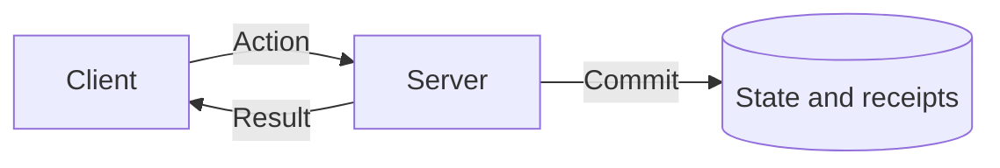

# @yielded/starlight-theme

The shared Starlight theme for yielded.dev docs: design tokens, a TanStack-style library
switcher in the header, Tokyo Night code blocks, link preview images, and Markdown helpers.

```ts
// docs/astro.config.ts
import starlight from "@astrojs/starlight";
import yieldedTheme from "@yielded/starlight-theme";
import { defineConfig } from "astro/config";

export default defineConfig({
  site: "https://yielded.dev",
  base: "/sync",
  integrations: [
    starlight({
      title: "Yielded Sync",
      plugins: [yieldedTheme({ library: "sync", replacements: { SYNC_VERSION: "0.1.0" } })],
      sidebar: [/* ... */],
    }),
  ],
});
```

The plugin sets the library's accent color, the GitHub social link, and an edit link to
`<repository>/edit/main/docs/` unless you configure them yourself.

## Link previews

`astro build` renders a 1200×630 card for every page at `og/<page>.png` and an
`apple-touch-icon.png` for the site. A card shows the library, the page's sidebar group, and
the page's `title` and `description` frontmatter, so those fields are what a shared link
says. A page that sets `og:image` in its frontmatter `head` keeps its own image.

Cards need `site` in the Astro config. They render from the built HTML, so the dev server
links to images it does not serve.

Sites outside Starlight can use the same renderer. Add the integration, then give each page
`og:title`, `og:description`, and an `og:image` of `<site>/og/<page>.png`:

```ts
import linkPreviews from "@yielded/starlight-theme/link-previews";

export default defineConfig({ site: "https://yielded.dev", integrations: [linkPreviews()] });
```

## Markdown helpers

These run on Astro's default Markdown processor (Sätteri):

- **Page links.** Relative links such as `../guide/sessions.md#configure` resolve against the
  linking file, the way they do on GitHub, and become `/<base>/guide/sessions/#configure`.
  Root-relative links such as `/guide/sessions` gain the site base.
- **Replacements.** `{{KEY}}` tokens in text, code, and URLs are replaced from the
  `replacements` option, such as a package version read from `package.json`.
- **Includes.** `<!--@include: ../path/file.md#region-->` inlines a
  `<!-- #region name -->` … `<!-- #endregion name -->` block from another file. Paths resolve
  against the including file, or against the docs project root with `@/`. VitePress-style
  code titles (`ts [file.ts]`) in included content become `title="file.ts"`.
- **Mermaid diagrams.** Fenced `mermaid` blocks in Markdown and MDX render as SVG
  diagrams using the site's fonts and light/dark palette. Wide diagrams
  scroll within the page. Mermaid loads only on pages containing diagrams;
  the source stays readable when JavaScript is unavailable.

````md

````

Use Mermaid for diagram types the [diagram components](#diagram-components) do not cover.
Use `accTitle` and `accDescr` to give diagrams accessible names and descriptions.
The shared renderer in `src/mermaid.ts` controls typography, spacing, and colors;
`src/styles/mermaid.css` controls surfaces, shapes, and label masking. Keep each
diagram's layout and relationships in its Markdown definition.

For includes in MDX, use the `Snippet` component because MDX has no HTML comments:

```mdx
import { Snippet } from "@yielded/starlight-theme/components";

<Snippet src="../README.md" region="auth-contract" />
<Snippet src="snippets/agent.ts" region="define" title="agent.ts" />
```

`src` resolves from the docs project root. A Markdown source must contain one code block; any
other file is used as-is, and `// #region name` markers select part of it.

## Diagram components

Draw architecture and request flows with components when ownership matters. The accent
marks what the library runs, named from the plugin's `library` option ("Yielded Auth");
neutral marks the application's code. Each component lays out for narrow screens and
both color schemes; its props are documented in its source.

| Component         | Shows                                                                          |
| ----------------- | ------------------------------------------------------------------------------ |
| `FlowMap`         | Nodes on a grid joined by connectors, with an optional boundary row and groups |
| `Trace`           | One request moving between lanes, step by step                                 |
| `CallSites`       | A source block wired to the places that call it                                |
| `OwnershipLadder` | Who owns each layer at each level of adoption                                  |
| `TableMap`        | An application table beside the managed tables that reference it               |

```mdx
import { FlowMap } from "@yielded/starlight-theme/components";

<FlowMap
  title="Shared contract"
  description="The client sends contract actions over HTTP to the routes, which call the service."
  columns={3}
  boundary={{ row: 2, above: "Browser", below: "Server" }}
  nodes={[
    { id: "client", at: [1, 3], owner: "library", title: "Client", code: "Client.make(Api)" },
    { id: "routes", at: [3, 3], owner: "library", title: "HTTP routes" },
    { id: "service", at: [3, 2], owner: "app", title: "Your service" },
  ]}
  edges={[
    { from: "client", to: "routes", label: "HTTP" },
    { from: "routes", to: "service" },
  ]}
/>
```

Place each node with `at: [row, column]`. Connectors run straight between nodes that share
a row or column and take one rounded turn otherwise, so keep connected nodes aligned and
the path between them clear. `title` and `description` name the diagram for screen readers.
FlowMap and Trace draw their connectors with a small script; without JavaScript, the nodes
and steps still render.

## Installing with Bun's isolated linker

Starlight's `Tabs`, `Steps`, and `FileTree` components import `satteri`, which loads a
native binding. Add `satteri` as a direct dependency of the docs workspace so Vite leaves it
external and the binding resolves at build time.
